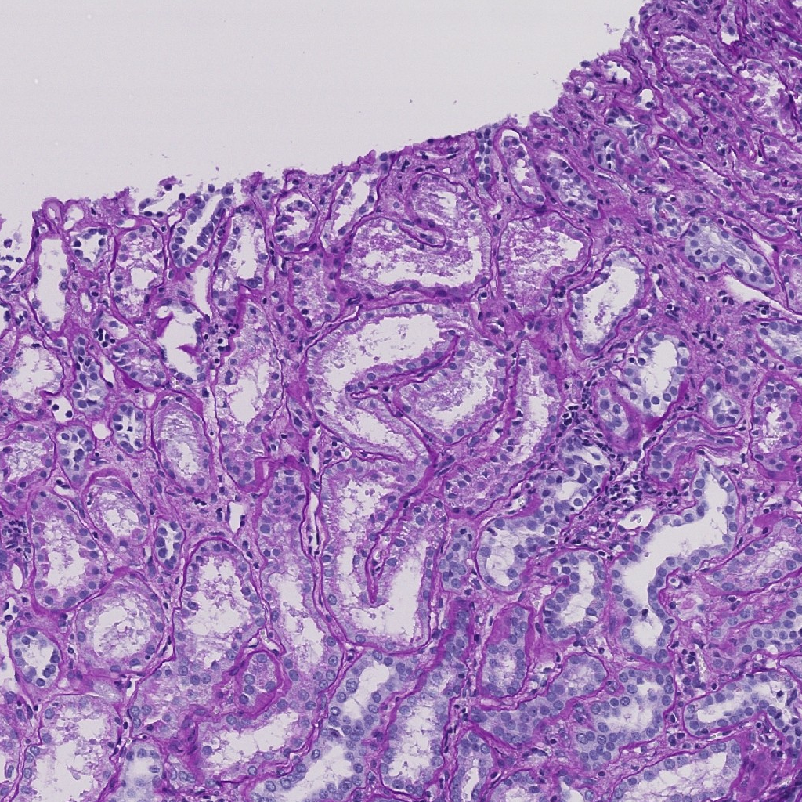
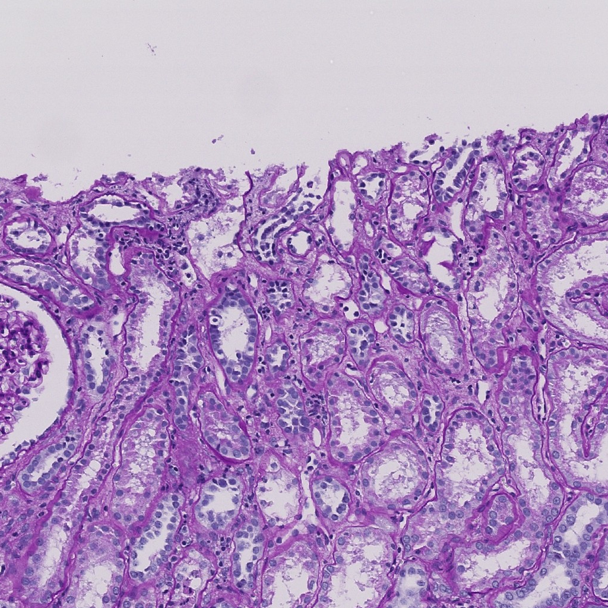

---

# Pathology Data Analysis Repository

This repository provides a step-by-step guide to working with pathology data, including:

1. **Extracting Tissue Mask from Images**  
   Refer to the notebook: `code/1_Extract_Tissue_Mask.ipynb`

2. **Generating Pathology Segmentation Patches (Glomerulus)**  
   Utilizing the tissue mask to extract segmentation patches.  
   Refer to the notebook: `code/2_Extract_Glomerulus_Patch.ipynb`

## A Brief Description of the Algorithm for Generating Tissue Masks

1. **Achromatic Areas, Excluding White, Have a Low Probability of Being Tissue Masks**  
   Achromatic areas, excluding white, are unlikely to be tissue masks. Markings or dark regions where light does not penetrate may be mistakenly recognized as tissue masks, leading to false positives. These regions are detected and their color is converted to white.

2. **Converting the Image to LAB Space**  
   After converting the image to LAB space, regions where the L value is below a certain threshold are defined as tissue masks. This can be intuitively understood as considering areas where "light cannot penetrate" as tissue masks.

3. **Refining the Tissue Mask**  
   The tissue mask obtained through this process is refined using a combination of `binary_dilation`, `binary_erosion`, `remove_small_holes`, and `remove_small_objects`. This not only makes the tissue mask visually cleaner but also significantly reduces the file size of the tissue mask.

## Recommended System Requirements

To ensure optimal performance, I recommend the following system specifications:

### Hardware
- **CPU**: Intel i7 (9th Gen or newer) / AMD Ryzen 7 (3rd Gen or newer)
- **RAM**: 32 GB or higher
- **Storage**: SSD with at least 256 GB of free space

I performed all tasks related to this repo using a gaming laptop with the following specifications: 
8-core 16-thread Intel 10th Gen i7 processor and 32GB of RAM. The model name is Dell Alienware M17 R4.

## Data Preparation and Results

- Place the downloaded dataset in `data/0_source_data/hubmap-kidney-segmentation` and process it to obtain the same results as described in this repository.
- The complete tissue mask results can be found in the directory: `data/1_tissue_mask`.
- The extracted segmentation patches (e.g., glomerulus patches) are stored in the directory: `data/2_extract_patch`.
  

  
  

  <b>Figure 1:</b> Original WSI (left) and Tissue Mask (right).

  
  
  

  <b>Figure 2:</b> Negative Image Patch (left), Mask Patch (center), Tissue Patch (right).

  
  
  

  <b>Figure 3:</b> Positive Image Patch (left), Mask Patch (center), Tissue Patch (right).

## Data Source

The dataset used in this project is sourced from the Kaggle competition:  
[HuBMAP - Kidney Segmentation](https://www.kaggle.com/competitions/hubmap-kidney-segmentation)

## Docker Environment

With Docker, you can easily set up a development environment.  
This Docker image was created while I was working at MI2RL (Medical Image to Reality Lab) and is fully prepared to handle a variety of medical images.  
  
Using the scripts in the `docker/` folder:  
  
Run `docker/1_build_container.sh` to build the Docker image.  
Then, run `docker/2_build_container.sh` to execute the container.  
Once executed, the Jupyter Notebook will automatically launch on port `28888` with the password set to `root`.  
It provides a very convenient local development environment!

## Future Work

We are currently preparing a research paper on **Segmentation Loss** based on the methods demonstrated in this repository.

## Contact

If you have any questions or suggestions, feel free to reach out via:  
📧 **Email**: tobeor3009@gmail.com  
💬 **GitHub Issues**

--- 

Let me know if you need further refinements! 😊
